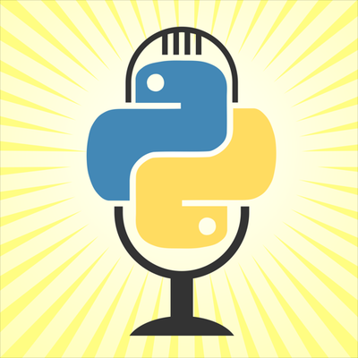

# PyEugene

[Upcoming Meetups](https://www.meetup.com/pyeugene/)

## Sponsors

### Talk Python Training

Talk Python Training provides online Python courses across a wide range of topics, including web development, data access, Pythonic code, and much more.

Participants at meetups may enter a drawing to win a promo code for free courses, [Building data-driven web apps with Pyramid and SQLAlchemy](https://training.talkpython.fm/courses/explore_pyramid/building-data-driven-web-applications-in-python-with-pyramid-sqlalchemy-and-bootstrap) and [Python Jumpstart by Building 10 Apps](https://training.talkpython.fm/courses/details/python-language-jumpstart-building-10-apps). Roughly $118 value.